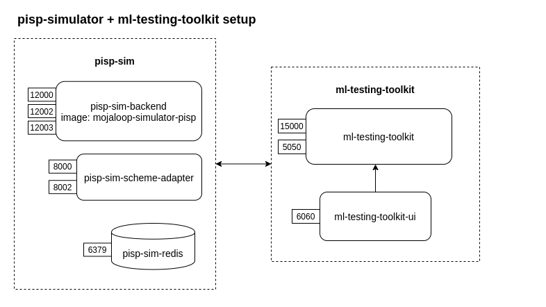

# Contract tests between PISP Simulator and ml-testing-toolkit

The aim of this document is to configure API contract tests between the PISP simulator and ml-testing-toolkit, so that we can have a reliable interface between PISPs and Mojaloop.

## Repo layout

 PISP Simulator and mojaloop-testing-toolkit configuration
- [`mojaloop-testing-toolkit`](./ml-testing-toolkit)
- [`pisp-sim`](./pisp-sim)

## Services and Backend components
   The purpose of this setup is to run contract tests between the PISP simulator and ml-testing-toolkit using docker-compose.

   Services are composed in the testing layout as:

- [_ml-testing-toolkit_](https://github.com/mojaloop/ml-testing-toolkit) :  Mojaloop Testing Toolkit is a standard integration testing tool between a Digital Financial Service Provider (DFSP) and the Mojaloop Switch (Hub), to facilitate testing. This tool set can potentially be used by both the DFSP and the Mojaloop Switch to verify the integration between the 2 entities.
- [_ml-testing-toolkit-ui_](https://github.com/mojaloop/ml-testing-toolkit-ui) : This is front end application(Web UI) to access Mojaloop Testing Toolkit.
- _PISP-SIM_ :  It is customized mojaloop-simulator to represent Payment Initiate System Provider where its dependencies are:
    - pisp-sim-backend: [mojaloop-simulator](https://github.com/mojaloop/mojaloop-simulator/tree/pisp/master)
    - pisp-sim-scheme-adapter: [scheme-adapter](https://github.com/mojaloop/sdk-scheme-adapter/tree/pisp/master)
    - pisp-sim-redis: redisDB
  > configuration folder: [pisp](./pisp-sim)


## Prerequisites
- `docker` - `v18.06.0` or higher
- `docker-compose`. We are using a compose file of `v3.7`. So you need at least `docker-compose` `v1.22`
- `node` and `npm`. We are using `node v12.16.1` at the time of writing

- Update hosts file with the following entries:
```
127.0.0.1  mojaloop-testing-toolkit
```

## Start services using `docker-compose`

```bash
# start all services in background
docker-compose up -d

# Check to see if they are running and healthy
docker-compose ps
```
It may take a little while for the services to healthy.

### Logging:

Use `docker-compose logs -f` to tail the logs of any given container. 

You may want to do this in separate terminal sessions to easily debug each service.

```bash
docker-compose logs -f mojaloop-testing-toolkit
docker-compose logs -f ml-testing-toolkit-ui
docker-compose logs -f pisp-sim-backend pisp-sim-scheme-adapter pisp-sim-redis
```
## ml-testing-toolkit configuration

`ml-testing-toolkit` has capabilities to perform Schema and Content Validation.  It reads the current API definition being used, and based on that validates the incoming and outgoing messages.
To configure new resource or modify existing API definition, update [api_spec.yaml and callback_map.json](./ml-testing-toolkit/spec_files/api_definitions/fspiop_1.1) files.
And add new callback response in [default.json](./ml-testing-toolkit/spec_files/rules_callback).This can be either FIXED_CALLBACK or MOCK_CALLBACK (based on rules).
We can do these changes from front end also using web interface (http://mojaloop-testing-toolkit:6060/).


>[Users Guide Mojaloop Testing Toolkit](https://github.com/mojaloop/ml-testing-toolkit/blob/master/documents/User-Guide-Mojaloop-Testing-Toolkit.md)

## Run Contract Tests

```bash
# Run the contract tests
cd ./docker-contract
npm run test:contract
```
> Note: You can also invoke these tests using Jest's  `watch` mode:
```bash
npm run test:contract -- --watch
```
```bash
 PASS  test/contract/PostAuthorizations.test.ts
  POST Authorizations Tests
    ✓ Test post /authorizations request (38 ms)

 PASS  test/contract/P2PTransfer.test.ts
  Peer to Peer transfer
    ✓ Performs a P2P transfer from Alice -> Bob (667 ms)

 PASS  test/contract/PISPTransfer.test.ts
  PISP initiated transfer
    1. PISP GET /parties & /transactionRequests
      ✓ initites the transaction request (486 ms)
    2. PISP POST /quotes
      ✓ creates the quote (218 ms)

Test Suites: 3 passed, 3 total
Tests:       4 passed, 4 total
Snapshots:   0 total
Time:        2.282 s, estimated 3 s
Ran all test suites.
```


## Run SPA@TTK applications
Single Page Application on TTK is for testing purposes where in PISP flow is the need to simulate users's authentication and authorization on DFSP side

### Running using docker-compose
```bash
cd docker-contract
docker-compose up ml-testing-toolkit ml-testing-toolkit-ui
```
## preparation
Before running tests there is a need to make preparation and store the list of accounts for given `consentRequestId` so they will be available in SPA app
### list of accounts url: POST: `http://ml-testing-toolkit:15000/store/consentRequests/3b346cec-47b3-4def-b870-edb255aaf6c3`

```json
{
    "scopes": [
        {
            "accountId": "dfspa.username.1234",
            "actions": [
                "accounts.transfer",
                "accounts.getBalance"
            ]
        },
        {
            "accountId": "dfspa.username.5678",
            "actions": [
                "accounts.transfer",
                "accounts.getBalance"
            ]
        }
    ]
}
```

> For an example script to populate the list of accounts, see [`../scripts/_configure_web_simulator.sh`](../scripts/_configure_web_simulator.sh)

### sending OTP: POST: `http://ml-testing-toolkit:15000/sendOTP`
```json
{
    "userName": "dfspa.user.name",
    "consentRequestId": "3b346cec-47b3-4def-b870-edb255aaf6c3",
    "message": "9876"
}
```

### Login page - AUTHORIZE
- the example url format is: `http://localhost:6060/admin/dfsp/authorize?consentRequestId=3b346cec-47b3-4def-b870-edb255aaf6c3&callbackUri=http://pisp-app.com.local:16000/callback` where parameters are:
  - `localhost:6060` - testing toolkit UI host
  - SPA resource path: `admin/dfsp/authorize`
  - `consentRequestId` - the id of the consent request
  - `callbackUri` - where the redirection should be done after the login / consent grant 
- special user for testing authorize failure: `fail-test`

After granting/rejecting the consent users is redirected from TTK back to PISP app using redirection URL in format
- `http://pisp-app.com.local:16000/callback?status=accepted&consentRequestId=3b346cec-47b3-4def-b870-edb255aaf6c3&secret=some-secret` where parameters are:
  - `pisp-app.com.local:16000` is the PISP web/mobile app
  - `status`: `accepted | rejected`
  - `consentRequestId` - the id of the consent request