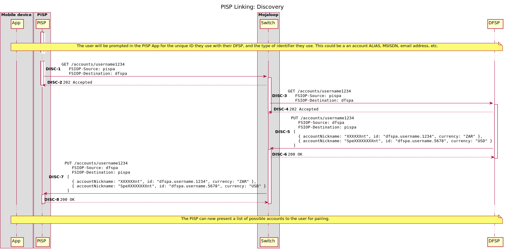
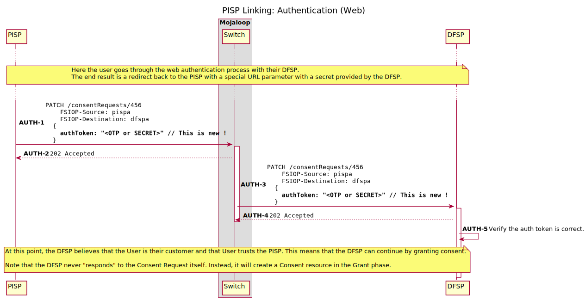
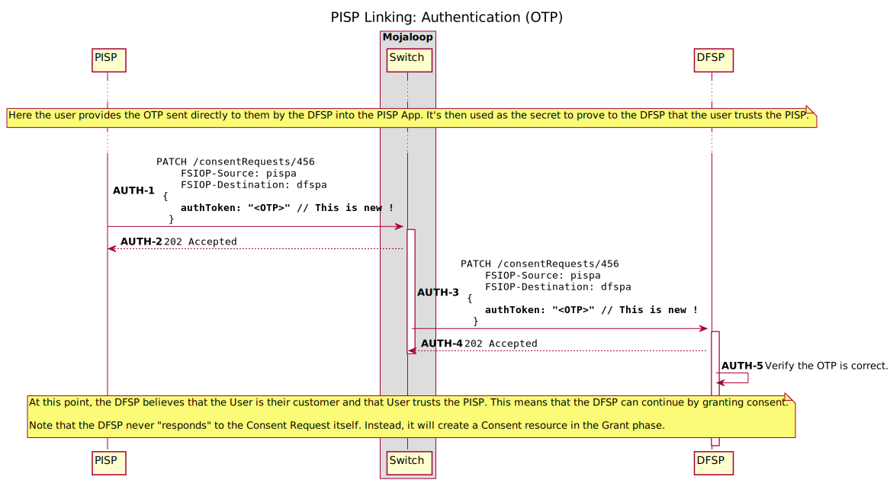
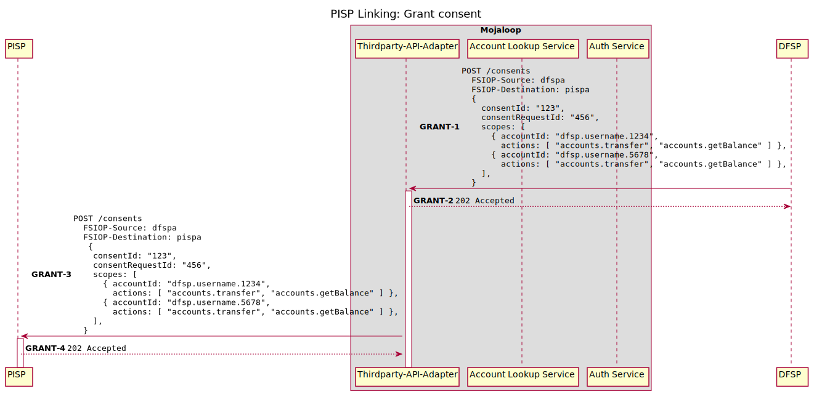
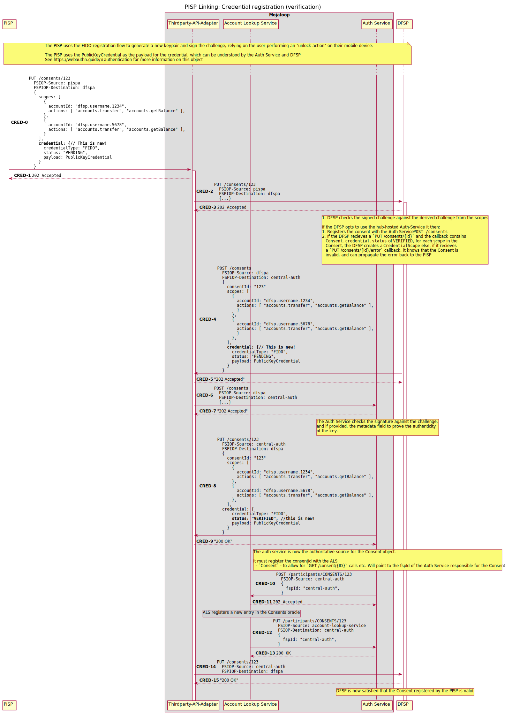
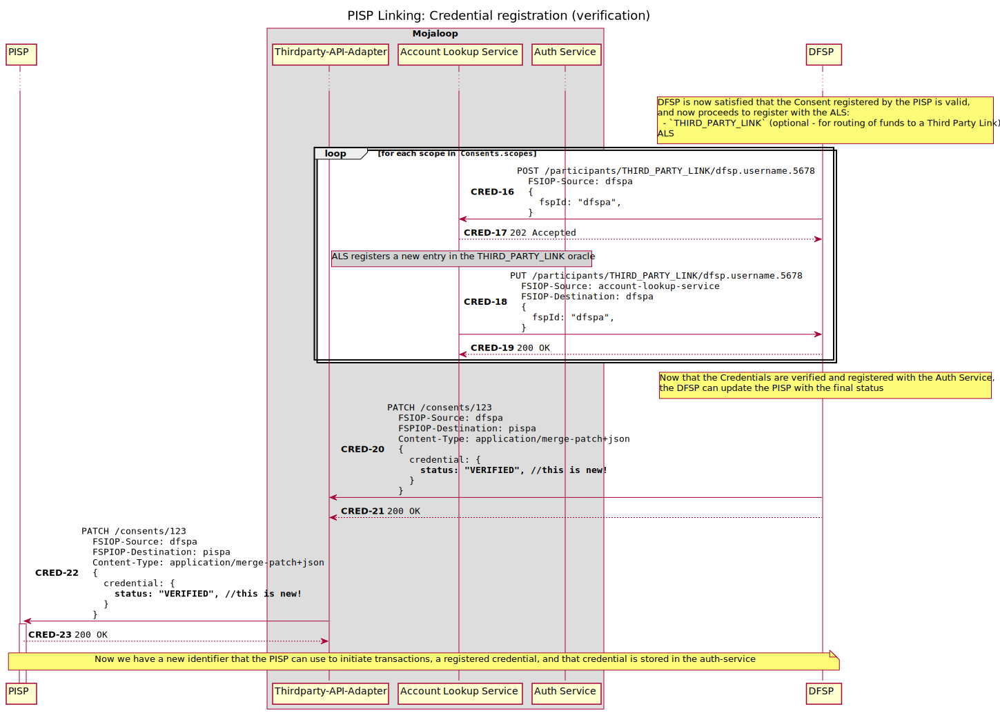

<h1>Contents</h1>

<!-- TOC -->

- [1. Linking](#1-linking)
    - [1.1. Pre-linking](#11-pre-linking)
    - [1.2. Discovery](#12-discovery)
    - [1.3. Request consent](#13-request-consent)
        - [1.3.1. Web](#131-web)
        - [1.3.2. OTP / SMS](#132-otp--sms)
    - [1.4. Authentication](#14-authentication)
        - [1.4.1. Web](#141-web)
        - [1.4.2. OTP](#142-otp)
    - [1.5. Grant consent](#15-grant-consent)
    - [1.6. Credential registration](#16-credential-registration)
        - [1.6.1. Requesting a challenge](#161-requesting-a-challenge)
        - [1.6.2. Finalizing the credential](#162-finalizing-the-credential)
- [2. Unlinking](#2-unlinking)
- [3. Third-party credential registration](#3-third-party-credential-registration)
    - [3.1. Authentication](#31-authentication)
    - [3.2. Credential registration](#32-credential-registration)

<!-- /TOC -->

# 1. Linking

The goal of the linking process is to explain how users establish trust between
all three interested parties:

1. User
2. DFSP where User has an account
3. PISP that User wants to rely on to initiate payments

*NOTE: For now, we're focusing on the FIDO / Web authentication channel.*

Linking is broken down into several separate phases:

1. **Pre-linking**
   In this phase, a PISP asks what DFSPs are available to link with.
2. **Request consent**
   In this phase, a PISP attempts to establish trust between the 3 parties.
3. **Authentication**
   In this phase, a User proves their identity to their DFSP.
4. **Grant consent**
   In this phase, a PISP proves to the DFSP that the User and PISP have
   established trust and, as a result, the DFSP confirms that mutual trust
   exists between the 3 parties.
5. **Credential registration**
   In this phase, a User establishes the credential they'll use to consent to
   future transfers from the DFSP and initiated by the PISP.

## 1.1. Pre-linking

In this phase, a PISP Server needs to know what DFSPs are available to link
with. This is *unlikely* to be done on-demand (e.g., when a User clicks "link"
in the PISP mobile App), and far more likely to be done periodically and cached
by the PISP Server. The reason for this is simply that new DFSPs don't typically
join the Mojaloop network all that frequently, so calling this multiple times on
the same day (or even the same month) would likely yield the same results.

The end-goal of this phase is for the PISP Server to have a final list of DFSPs
available and any relevant metadata about those DFPSs that are necessary to
begin the linking process.


## 1.2. Discovery

In this phase, we ask the user to select the type and value of identifier they use 
with the DFSP they intend to link with. This could be a username, MSISDN (phone number), 
or email address.

The result of this phase is a list of potential accounts available for linking.
The user will then choose one or more of these source accounts and the PISP will
provide these to the DFSP when requesting consent.

The DFSP MAY send back an `accountNickname` to the PISP in the list of accounts. This list
will be displayed to the user in the PISP application for them to select which accounts
they wish to link. A DFSP could obfuscate some of the nickname depending on their requirements
for displaying account information without authorizing the user.

**NOTE:** When using the Web authentication channel, it's possible that the
choices made (i.e., the accounts to link with) will be overridden by the user in
a web view. In other words, the user may decide during the Authentication phase
that they actually would like to link a different account than those chosen at
the very beginning. This is perfectly acceptable and should be expected from
time to time.



## 1.3. Request consent

In this phase, a PISP is asking a specific DFSP to start the process of
establishing consent between three parties:

1. The PISP
2. The specified DFSP
3. A User that is presumed to be a customer of the DFSP in (2)

The PISPs request to establish consent must include a few important pieces of
information:

- The authentication channels that are acceptable to the User
- The scopes required as part of the consent (in this case, almost always just
  the ability to view a balance of a specific account and send funds from an
  account).

Some information depends on the authentication channel used (either web or OTP).
Specically, if the web authentication channel is used, the following extra
information is required:

- A callback URI of where a user can be redirected with any extra information.

The end result of this phase depends on the authentication channel used:

### 1.3.1. Web

In the web authentication channel, the result is the PISP being instructed on
a specific URL where this supposed user should be redirected. This URL should be
a place where the user can prove their identity (e.g., by logging in).


### 1.3.2. OTP / SMS

In the OTP authentication channel, the result is the PISP being instructed on
a specific URL where this supposed user should be redirected. This URL should be
a place where the user can prove their identity (e.g., by logging in).


## 1.4. Authentication

In the authentication phase, the user is expected to prove their identity to the
DFSP. Once this is done, the DFSP will provide the User with some sort of secret
(e.g., an OTP or access token). This secret will then be passed along to the
PISP so that the PISP can demonstrate a chain of trust:

- The DFSP trusts the User
- The DFSP gives the User a secret
- The User trusts the PISP
- The User gives the PISP the secret that came from the DFSP
- The PISP gives the secret to the DFSP
- The DFSP verified that the secret is correct

This chain results in the conclusion: The DFSP can trust the PISP is acting on
behalf of the User, and mutual trust exists between all three parties.

The process of establishing this chain of trust depends on the authentication
channel being used:

### 1.4.1. Web

In the web authentication channel, the user is actually redirected to the DFSP's
website where they can prove their identity (likely by a typical username and
password style login).

**Note:** Keep in mind that at this stage, the User may update their choices of
which accounts to link with. The result of this will be seen later on when
during the Grant consent phase, where the DFSP will provide the correct values
to the PISP in the `scopes` field.



### 1.4.2. OTP

When using the OTP authentication channel, the DFSP will send the User some sort
of one-time password over a pre-established channel (most likely SMS). The PISP
should prompt the user for this secret and then provide that back to the DFSP.



## 1.5. Grant consent

Now that mutual trust has been established between all three parties, the DFSP
is able to create a record of that fact by creating a new Consent resource.
This resource will store all the relevant information about the relationship
between the three parties, and will eventually contain additional information
for how the User can prove that it consents to each individual transfer in the
future.

This phase consists exclusively of the DFSP requesting that a new consent be
created. This request must be conveyed both to the PISP itself.




## 1.6. Credential registration

Once the consent resource has been created, the PISP will attempt to establish
with the network the credential that should be used to verify that a user has
given consent for each transfer in the future.

This will be done by storing a FIDO credential (e.g., a public key) on the Auth
service inside the consent resource. When future transfers are proposed, we will
require that those transfers be digitally signed by the FIDO credential (in this
case, the private key) in order to be considered valid.

This credential registration is composed of three phases: (1) deriving the 
challenge, (2) registering the credential, and (3) finalizing the consent.

### 1.6.1. Deriving the challenge

The PISP must derive the challenge to be used as an input to the FIDO Key 
Registration step. This challenge must not be guessable ahead of time by 
the PISP.


1. _let `consentId` be the value of the `body.consentId` in the `POST /consents` request_  
2. _let `scopes` be the value of `body.scopes` in the `POST /consents` request_

3. The PISP must build the JSON object `rawChallenge`
```
{
   "consentId": <body.consentId>,
   "scopes": <body.scopes>
}
```

4. Next, the PISP must convert this json object to a string representation using a [RFC-8785 Canonical JSON format](https://tools.ietf.org/html/rfc8785)

5. Finally, the PISP must calculate a SHA-256 hash of the canonicalized JSON string.
i.e. `SHA256(CJSON(rawChallenge))`

The output of this algorithm, `challenge` will be used as the challenge for the [FIDO registration flow](https://webauthn.guide/#registration)


### 1.6.2 Registering the credential


Once the PISP has derived the challenge, the PISP will generate a new
credential on the device, digitally signing the challenge, and provide the some new
information about the credential on the Consent resource:

1. The `PublicKeyCredential` object - which contains the key's Id, and an [AuthenticatorAttestationResponse](https://w3c.github.io/webauthn/#iface-authenticatorattestationresponse) which contains the public key
2. A `credentialType` field set to `FIDO`
3. a `status` field set to `PENDING`


The Auth service is then responsible for calling `POST /participants/CONSENTS/{id}`.
This call will associate the `consentId` with the auth-service's `participantId` and 
allows us to look up the Auth service given a `consentId` at a later date.




### 1.6.3. Finalizing the credential

Once the PISP has derived the challenge, the PISP will generate a new
credential on the device, digitally sign the challenge, and provide the some new
information about the credential on the Consent resource:

1. The credential itself (the public component)
2. A signature of the challenge (to be verified against this public component)
3. The ID of the credential understood by the device itself

[
   todo:
   - signing metadata so that the signed challenge can be understood by the DFSP
   - ensure that we have covered cases where there is a cred per scope or something...

]

This information is provided back to the Auth service, which then verifies that
the signature is correct. It then updates the status of the credential to
`"VERIFIED"`, and notifies both the PISP and the DFSP about these new changes
to the Consent resource.




<!-- > **Notes:**
> 1. As with step [1.6.1](#161-requesting-a-challenge) above, the PISP doesn't need to include the `FSPIOP-Destination` header in `PUT /consents/{ID}`. The switch is responsible for finding the responsible Auth service for this consent based on the `consentId` -->

# 2. Unlinking

At some point in the future, it's possible that a User, PISP, or DFSP may decide
that the relationship of trust previously established should no longer exist.
For example, a very common scenario might be a user losing their mobile device
and using an interface from their DFSP to remove the link between the lost
device, the PISP, and the DFSP.

To make this work, we simply need to provide a way for a member on the network
to remove the Consent resourse and notify the other parties about the removal.


# 3. Third-party credential registration

There is ongoing work with the FIDO alliance to allow third parties the ability
to collect a FIDO credential on behalf of the intended user of the credential.
In other words, this work would allow the DFSP (during the web authentication
flow) to ask the user to provide a FIDO credential that would be for use by the
PISP rather than the DFSP.

If this becomes possible, the flow changes, speciifcally in the Authentication
phase and the Credential registration phase.

## 3.1. Authentication

The authentication phase becomes very minimal. Since the credential will be
collected by the DFSP itself (for use later by the PISP), there's no need to
send back any sort of secret and no need to pass a secret back to the DFSP.


## 3.2. Credential registration

TODO!
