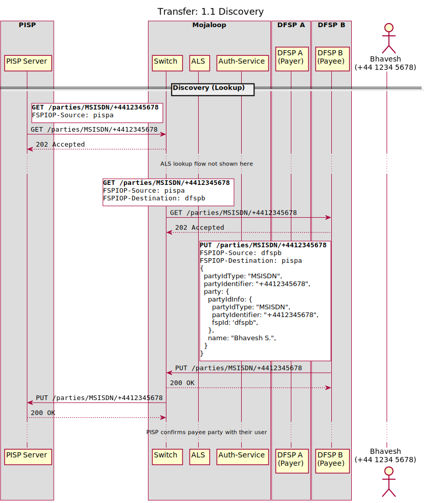
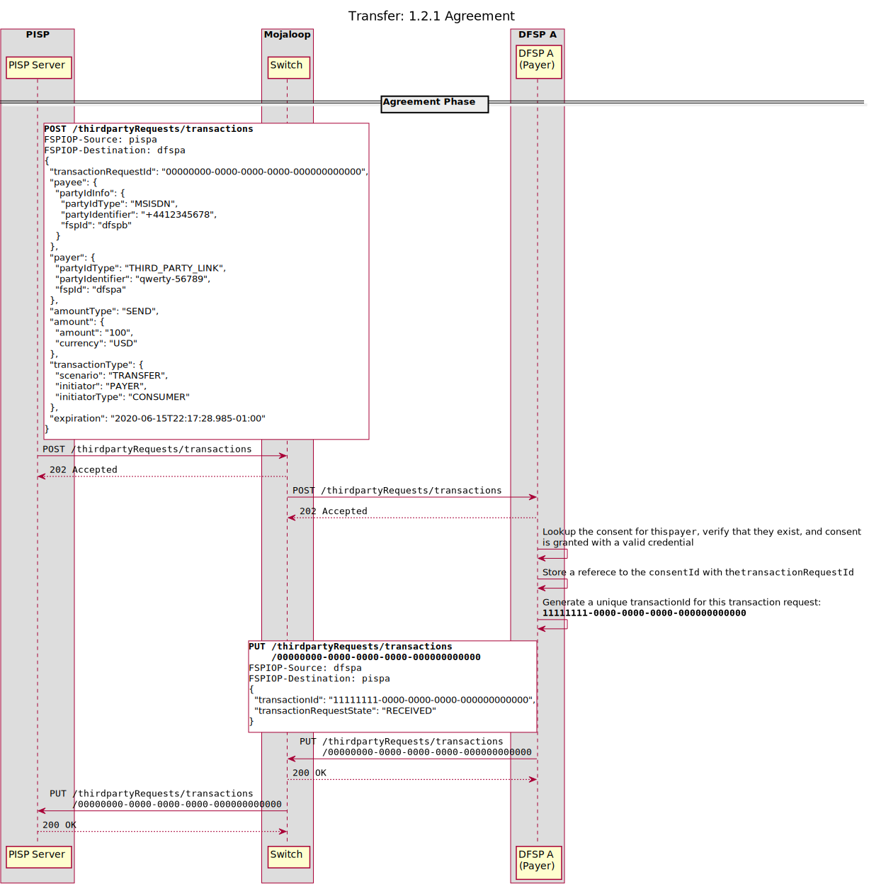
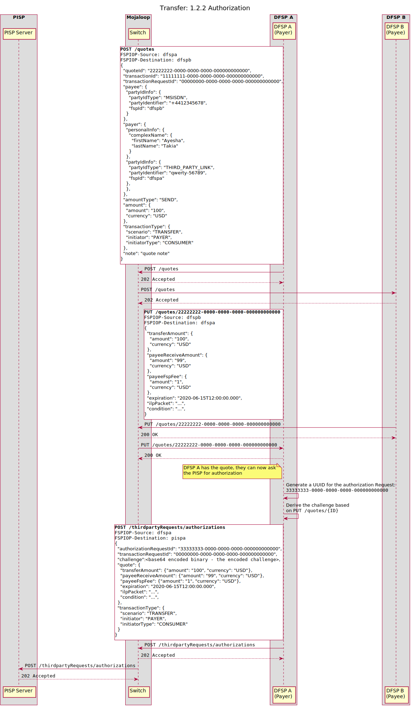
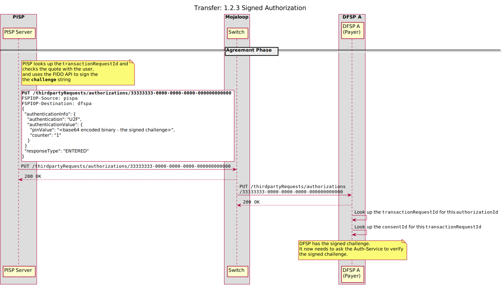
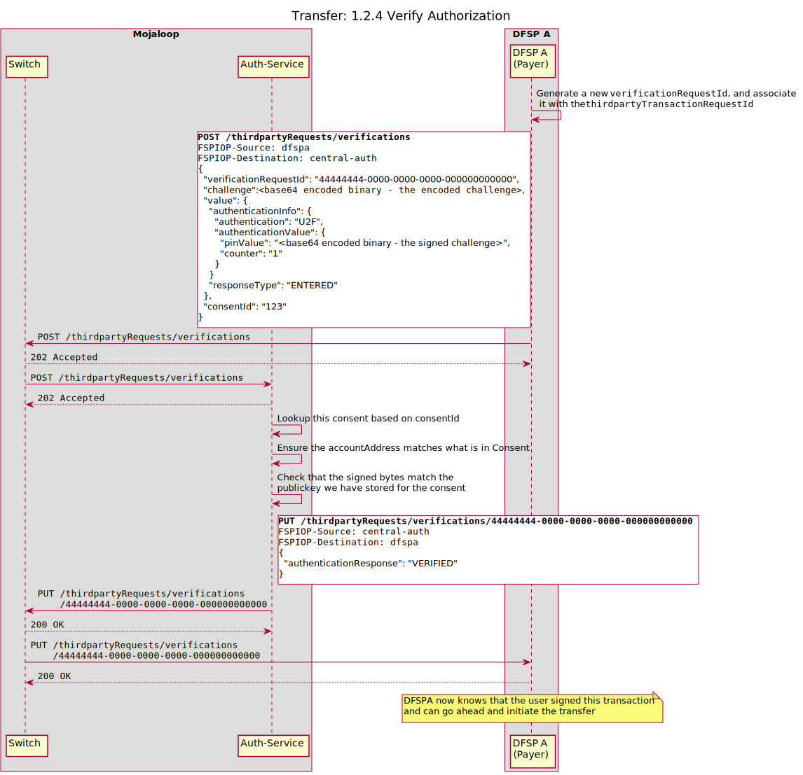
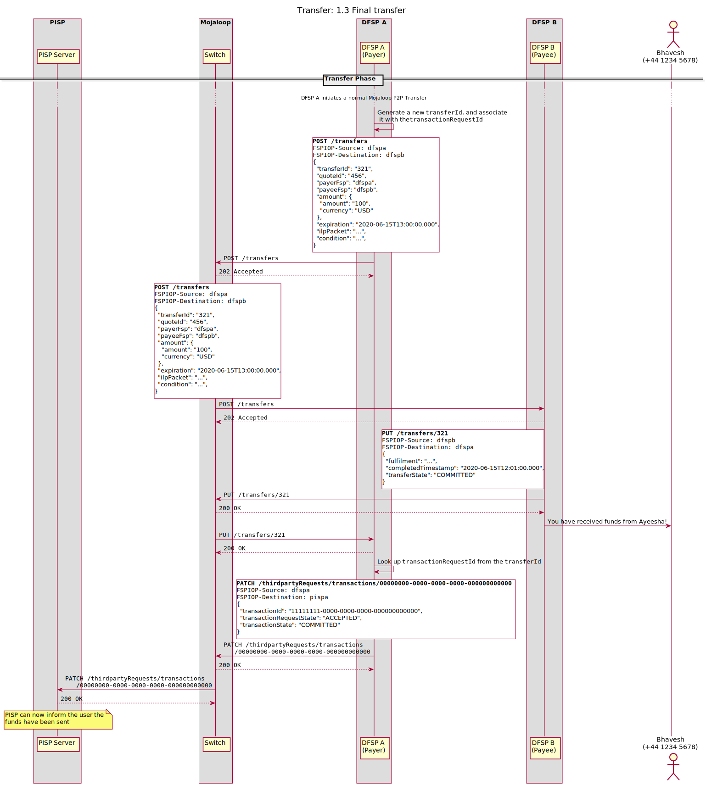

# Transfer API

<!-- vscode-markdown-toc -->
* [1. Transfers](#Transfers)
	* [1.1 Discovery](#Discovery)
	* [1.2 Agreement](#Agreement)
		* [1.2.1 `POST /thirdpartyRequests/transactions`](#POSTthirdpartyRequeststransactions)
		* [1.2.2 Thirdparty Authorization Request](#ThirdpartyAuthorizationRequest)
		* [1.2.3 Signed Authorization](#SignedAuthorization)
		* [1.2.4 Validate Authorization](#ValidateAuthorization)
	* [1.3 Transfer](#Transfer)
* [2. Request TransactionRequest Status](#RequestTransactionRequestStatus)
* [3. Error Conditions](#ErrorConditions)
* [4. Appendix](#Appendix)
* [4.1 Deriving the Challenge](#DerivingtheChallenge)

<!-- vscode-markdown-toc-config
	numbering=true
	autoSave=true
	/vscode-markdown-toc-config -->
<!-- /vscode-markdown-toc -->


## <a name='Transfers'></a>1. Transfers

Transfers is broken down into the separate sections:
1. **Discovery**: PISP looks up the Payee Party who they wish to recieve the funds

2. **Agreement** PISP confirms the Payee Party, and looks up the terms of the transaction. If the User accepts the terms of the transaction, they sign the transaction with the credential established in the Linking API flow

3. **Transfer** The Payer DFSP initiates the transaction, and informs the PISP of the transaction result.

###  <a name='Discovery'></a>1.1 Discovery

In this phase, a user enters the identifer of the user they wish to send funds to. The PISP executes a `GET /parties/{Type}/{ID}` (or `GET /parties/{Type}/{ID}/{SubId}`) call with the FSPIOP-API, and awaits a callback from the Mojaloop switch.

If the response is successful, the PISP will recieve a `PUT /parties` callback from the Mojaloop switch. The PISP then confirms the recieving party with their user.

Should the PISP receive a `PUT /parties/{Type}/{ID}/error` (or `PUT /parties/{Type}/{ID}/{SubId}/error`) callback, the PISP should display the relevant error to their user.



### <a name='Agreement'></a>1.2 Agreement

#### <a name='POSTthirdpartyRequeststransactions'></a>1.2.1 `POST /thirdpartyRequests/transactions`

Upon confirming the details of the Payee with their user, the PISP asks the user to enter the `amount` of funds they wish to send to the Payee, and whether or not they wish the Payee to _recieve_ that amount, or they wish to _send_ that amount (`amountType` field).

If the User has linked more than 1 account with the PISP application, the PISP application can ask the user to choose an account they wish to send funds from. Upon confirming the _source of funds_ account, the PISP can determine:
1. the `FSPIOP-Destination` as the DFSP who the User's account is linked with
2. The `payer` field of the `POST /thirdpartyRequests/transactions` request body. The `partyIdType` is `THIRD_PARTY_LINK`, the `fspId` is the fspId of the DFSP who issued the link, and the `partyIdentifier` is the `accountId` specified in the `POST /consents#scopes` body. 

> See [1.5 Grant Consent](../linking/README.md#15-grant-consent) for more information.

The PISP then generates a random `transactionRequestId` of type UUID (see [RFC 4122 UUID](https://tools.ietf.org/html/rfc4122)).



Upon receiving the `POST /thirdpartyRequests/transactions` call from the PISP, the DFSP performs some validation such as:
1. Determine that the `payer` identifer exists, and is one that was issued by this DFSP to the PISP specified in the `FSPIOP-Source`.
2. Confirms that the `Consent` that is identified by the `payer` identifier exists, and is valid.
3. Confirm that the User's account is open and holds enough funds to complete the transaction.
4. Any other validation that the DFSP wishes to do.

Should this validation succeed, the DFSP will generate a unique `transactionId` for the request, and call `PUT /thirdpartyRequests/transactions/{ID}` with this `transactionId` and a `transactionRequestState` of recieved. 

This call informs the PISP that the Thirdparty Transaction Request was accepted, and informs them of the final `transactionId` to watch for at a later date.

If the above validation fail, the DFSP should send a `PUT /thirdpartyRequests/transactions/{ID}/error` call to the PISP, with an error message communicating the failure to the PISP. See [Error Codes](../error_codes.md) for more information.

#### <a name='ThirdpartyAuthorizationRequest'></a>1.2.2 Thirdparty Authorization Request

The DFSP will then issue a quotation request (`POST /quotes`) to the Payee DFSP. Upon receiving the `PUT /quotes/{Id}` callback from the Payee DFSP, the Payer DFSP needs to confirm the details of the transaction with the PISP.

They use the API call `POST /thirdpartyRequests/authorizations`. The request body is populated with the following fields:

- `authorizationRequestId` - a random UUID generated by the DFSP to identify this Thirdparty Authorization Request 
- `challenge` - the challenge is a `BinaryString` which will be signed by the private key on the User's device. While the challenge 
could be a random string, we recommend that it be derived from something _meaningful_ to the actors involved in the transaction, 
that can't be predicted ahead of time by the PISP. See [Section 4.1](#DerivingtheChallenge) for an example of how the challenge
could be derived.
    > Note: this requirement could be enforced in scheme rules
- `quote` - the response body from the `PUT /quotes/{ID}` callback
- `transactionType` the `transactionType` field from the original `POST /thirdpartyRequests/transactions` request

<!-- TODO: there is an issue here! The `payer.partyIdInfo.partyIdType` will not be valid, since it's `THIRD_PARTY_LINK` - that's not valid FSPIOP API! -->





#### <a name='SignedAuthorization'></a>1.2.3 Signed Authorization

Upon receiving the `POST /thirdpartyRequests/authorizations` request from the DFSP, the PISP confirms the details of the 
transaction with the user, and uses the [FIDO Authentication](https://webauthn.guide/#authentication) flow to sign the `challenge`
with the private key on the user's device that was registered in [1.6.2 Registering the credential](../linking/README.md#162-registering-the-credential)

After retrieving the signed challenge from the user's device, the PISP sends a `PUT /thirdpartyRequests/authorizations/{ID}` call to the DFSP.





#### <a name='ValidateAuthorization'></a>1.2.4 Validate Authorization

> __Note:__ If the DFSP uses a self-hosted authorization service, this step can be skipped.

The DFSP now needs to check that challenge has been signed correctly, and by the private key that corresponds to the 
public key that is attached to the `Consent` object.

The DFSP uses the API call `POST /thirdpartyRequests/verifications`, the body of which is comprised of:

- `verificationRequestId` - A UUID created by the DFSP to identify this verification request.
- `challenge` - The same challenge that was sent to the PISP in [1.2.2 Thirdparty Authorization Request](#ThirdpartyAuthorizationRequest)
- `value` - The body of the `PUT /thirdpartyRequests/authorizations` from the PISP.
- `consentId` - The `consentId` of the Consent resource that contains the credential public key with which to verify this transaction.
The DFSP must lookup the `consentId` based on the `payee` details of the `ThirdpartyTransactionRequest`.



### <a name='Transfer'></a>1.3 Transfer

Upon validating the signed challenge, the DFSP can go ahead and initiate a standard Mojaloop Transaction using the FSPIOP API.

After receiving the `PUT /transfers/{ID}` call from the switch, the DFSP looks up the ThirdpartyTransactionRequestId for the given transfer, 
and sends a `PATCH /thirdpartyRequests/transactions/{ID}` call to the PISP.

Upon receiving this callback, the PISP knows that the transfer has completed successfully, and can inform their user.




## <a name='RequestTransactionRequestStatus'></a>2. Request TransactionRequest Status

A PISP can issue a `GET /thirdpartyRequests/{id}/transactions` to find the status of a transaction request.


1. PISP issues a `GET /thirdpartyRequests/transactions/{id}`
1. Switch validates request and responds with `202 Accepted`
1. Switch looks up the endpoint for `dfspa` for forwards to DFSP A
1. DFSPA validates the request and responds with `202 Accepted`
1. DFSP looks up the transaction request based on it's `transactionRequestId` (`123` in this case)
    - If it can't be found, it calls `PUT /thirdpartyRequests/transactions/{id}/error` to the Switch, with a relevant error message

1. DFSP Ensures that the `FSPIOP-Source` header matches that of the originator of the `POST //thirdpartyRequests/transactions`
    - If it does not match, it calls `PUT /thirdpartyRequests/transactions/{id}/error` to the Switch, with a relevant error message

1. DFSP calls `PUT /thirdpartyRequests/transactions/{id}` with the following request body:
    ```
    {
      transactionId: <transactionId>
      transactionRequestState: TransactionRequestState
    }
    ```

    Where `transactionId` is the DFSP-generated id of the transaction, and `TransactionRequestState` is `RECEIVED`, `PENDING`, `ACCEPTED`, `REJECTED`, as defined in [7.5.10 TransactionRequestState](https://docs.mojaloop.io/mojaloop-specification/documents/API%20Definition%20v1.0.html#7510-transactionrequeststate) of the API Definition


1. Switch validates request and responds with `200 OK`
1. Switch looks up the endpoint for `pispa` for forwards to PISP
1. PISP validates the request and responds with `200 OK`

## <a name='ErrorConditions'></a>3. Error Conditions


The PayerDFSP is responsible for communicating failures to the PISP

1. Thirdparty Transaction Request fails

2. Downstream Quote Failure

3. Authorization Failure

4. Transfer Failure


[ todo: in mojaloop/mojaloop#346 ]


## <a name='Appendix'></a>4. Appendix

### <a name='DerivingtheChallenge'></a>4.1 Deriving the Challenge

1. _let `quote` be the value of the response body from the `PUT /quotes/{ID}` call_
2. _let the function `CJSON()` be the implementation of a Canonical JSON to string, as specified in [RFC-8785 - Canonical JSON format](https://tools.ietf.org/html/rfc8785)_
3. _let the function `SHA256()` be the implementation of a SHA-256 one way hash function, as specified in [RFC-6234](https://tools.ietf.org/html/rfc6234)
4. The DFSP must generate the value `jsonString` from the output of `CJSON(quote)`
5. The `challenge` is the value of `SHA256(jsonString)`